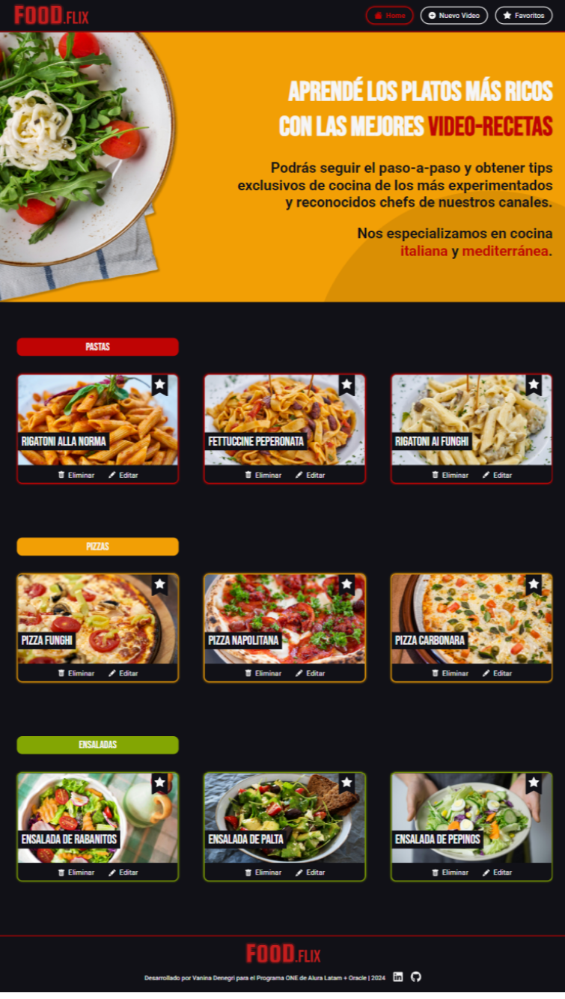

<h1>FOOD.FLIX :spaghetti: :heavy_plus_sign: :tv:</h1>
<p>
Proyecto realizado para el Challenge ONE React de La Formación en React de Alura Latam + Oracle G7.
</p>
<br>
<p align="center"></p>

<h2>Estado :battery:</h2>
<p align="left"></p>
<br>

<h2>Tecnologías :computer:</h2>
<p align="left">
     
<br>
<br>
   
</p>

<h2>Descripción del Proyecto :bulb:</h2>
<p>
Food Flix es una aplicación web que te permite guardar video-recetas culinarias. Podés crear nuevos videos, editarlos, eliminarlos, agregarlos a tus favoritos y reproducirlos en la página del player. 
<br>
<br>
El proyecto surge como solución al CHALLENGE ONE REACT de la Formación en React de Alura Latam + Oracle (G7). La temática inicial del Alura Flix fue remplazada por Food Flix para explorar otras posiblidades manteniendo un mismo esquema de diseño. Además de trabajar con tecnologías FrontEnd, parte del desafío fue el desarrollo con React y JavaScript, además de la creación de un servidor JSON simulado.
</b>

<h2>Requisitos del Challenge :clipboard:</h2>

<h3>Puntos principales :ok_hand:</h3>
<p>
:heavy_check_mark: congfiguración inicial en React.
<br>:heavy_check_mark: página Home donde de renderizan los videos según sus categorías.
<br>:heavy_check_mark: formulario de carga de datos para nuevos videos.
<br>:heavy_check_mark: uso de modales.
<br>:heavy_check_mark: integración con json-server para almacenamiento de datos (ver branch jsonserver2).
<br>:heavy_check_mark: se debe poder crear, editar y eliminar las tarjetas de videos.funcionalidad de renderizar productos (GET).
</p>

<h3>Extras :muscle:</h3>
<p>
<br>:heavy_check_mark: selección y página de favoritos.
<br>:heavy_check_mark: página para reproducción de los videos.
</p>

<h3>Puntos de mejora :arrow_up:</h3>
<p>
Cosas que quiero agregar en el futuro:
<br>:small_orange_diamond: mejorar la funcionalidad y el diseño para la verificación de los inputs.
<br>:small_orange_diamond: conectar con una API en línea.
</p>

<h2>Branches :bullettrain_side:</h2>

<h3>main</h3>
<p>
No tiene persistencia de datos. Al recargar la página lo realizado se pierde y vuelven a cargarse los videos prestablecidos.
<br>
Podés probar la página funcional en <a href="https://food-flix-by-vd.vercel.app/"></a> 
</p>

<h3>jsonserver2</h3>
<h4>Conectar con json-server :wrench:</h4>
<p>
:rotating_light: Requisitos previos: tener instalado Nodle.js.
<br>:one: Clonar este repositorio.
<br>:two: Abrir el proyecto en Visual Studio Code.
<br>:three: Conectar con el servidor JSON:
</p>

```bash
npm install json-server
```

```bash
npx json-server --watch database.json --port 3002
```
<p>
:four: Iniciar el proyecto.
<br>:arrow_right: <a href="https://postimg.cc/gallery/G9Xmbq3">Aguí</a> se encuentra una galería de imágenes que puedes usar para probar Food Flix </p>

<h2>Acceso al proyecto :link:</h2>
<p>
<br>
<a href="https://github.com/VannDennOk/food-flix.git"></a>
 <a href="https://food-flix-by-vd.vercel.app/"></a>
 <a href="#"></a>
</p>

<h2>Autoría :woman:</h2>
<p>
Esta página fue diseñada y desarrollada por Vanina Denegri.
<br>
<br>
<a href="https://github.com/VannDennOk"></a> <a href="https://www.linkedin.com/in/vaninadenegri/"></a>
</p>

<h2>Reconocimientos :crown:</h2>
<p>
Herramientas web utilizadas en este README:
<br>
<br>
<a href="https://shields.io/"></a> 
<a href="https://simpleicons.org/"></a>
<a href="https://gist.github.com/rxaviers/7360908"></a> 
</p>
<p>
Imágenes de uso libre:
<br>
<br>
<a href="https://www.pexels.com/es-es/">
</p>

<h2>Muestrame tu apoyo :gift_heart:</h2>
<p>
:star: Si te gustó mi proyecto podés dejarme alguna estrellita.
<br>:e-mail: Mandarme algún mensaje.
<br>:bell: Seguirme en redes para comentar y compartir.
<br>:gift_heart: Darme los reconocimientos correspondientes si es necesario.
</p>

<h2>Notas finales :exclamation:</h2>
<p>Estos son mis primeros proyectos. Aún me quedan muchas cosas por aprender y mejorar. Si tenés algún comentario para ayudarme a crecer lo recibiré atentamente, siempre y cuando venga con respeto.</p>

<h2>Licencia :warning:</h2>
<a href="https://opensource.org/license/MIT"></a></p>

----------------------------------------

# Getting Started with Create React App

This project was bootstrapped with [Create React App](https://github.com/facebook/create-react-app).

## Available Scripts

In the project directory, you can run:

### `yarn start`

Runs the app in the development mode.\
Open [http://localhost:3000](http://localhost:3000) to view it in your browser.

The page will reload when you make changes.\
You may also see any lint errors in the console.

### `yarn test`

Launches the test runner in the interactive watch mode.\
See the section about [running tests](https://facebook.github.io/create-react-app/docs/running-tests) for more information.

### `yarn build`

Builds the app for production to the `build` folder.\
It correctly bundles React in production mode and optimizes the build for the best performance.

The build is minified and the filenames include the hashes.\
Your app is ready to be deployed!

See the section about [deployment](https://facebook.github.io/create-react-app/docs/deployment) for more information.

### `yarn eject`

**Note: this is a one-way operation. Once you `eject`, you can't go back!**

If you aren't satisfied with the build tool and configuration choices, you can `eject` at any time. This command will remove the single build dependency from your project.

Instead, it will copy all the configuration files and the transitive dependencies (webpack, Babel, ESLint, etc) right into your project so you have full control over them. All of the commands except `eject` will still work, but they will point to the copied scripts so you can tweak them. At this point you're on your own.

You don't have to ever use `eject`. The curated feature set is suitable for small and middle deployments, and you shouldn't feel obligated to use this feature. However we understand that this tool wouldn't be useful if you couldn't customize it when you are ready for it.

## Learn More

You can learn more in the [Create React App documentation](https://facebook.github.io/create-react-app/docs/getting-started).

To learn React, check out the [React documentation](https://reactjs.org/).

### Code Splitting

This section has moved here: [https://facebook.github.io/create-react-app/docs/code-splitting](https://facebook.github.io/create-react-app/docs/code-splitting)

### Analyzing the Bundle Size

This section has moved here: [https://facebook.github.io/create-react-app/docs/analyzing-the-bundle-size](https://facebook.github.io/create-react-app/docs/analyzing-the-bundle-size)

### Making a Progressive Web App

This section has moved here: [https://facebook.github.io/create-react-app/docs/making-a-progressive-web-app](https://facebook.github.io/create-react-app/docs/making-a-progressive-web-app)

### Advanced Configuration

This section has moved here: [https://facebook.github.io/create-react-app/docs/advanced-configuration](https://facebook.github.io/create-react-app/docs/advanced-configuration)

### Deployment

This section has moved here: [https://facebook.github.io/create-react-app/docs/deployment](https://facebook.github.io/create-react-app/docs/deployment)

### `yarn build` fails to minify

This section has moved here: [https://facebook.github.io/create-react-app/docs/troubleshooting#npm-run-build-fails-to-minify](https://facebook.github.io/create-react-app/docs/troubleshooting#npm-run-build-fails-to-minify)
